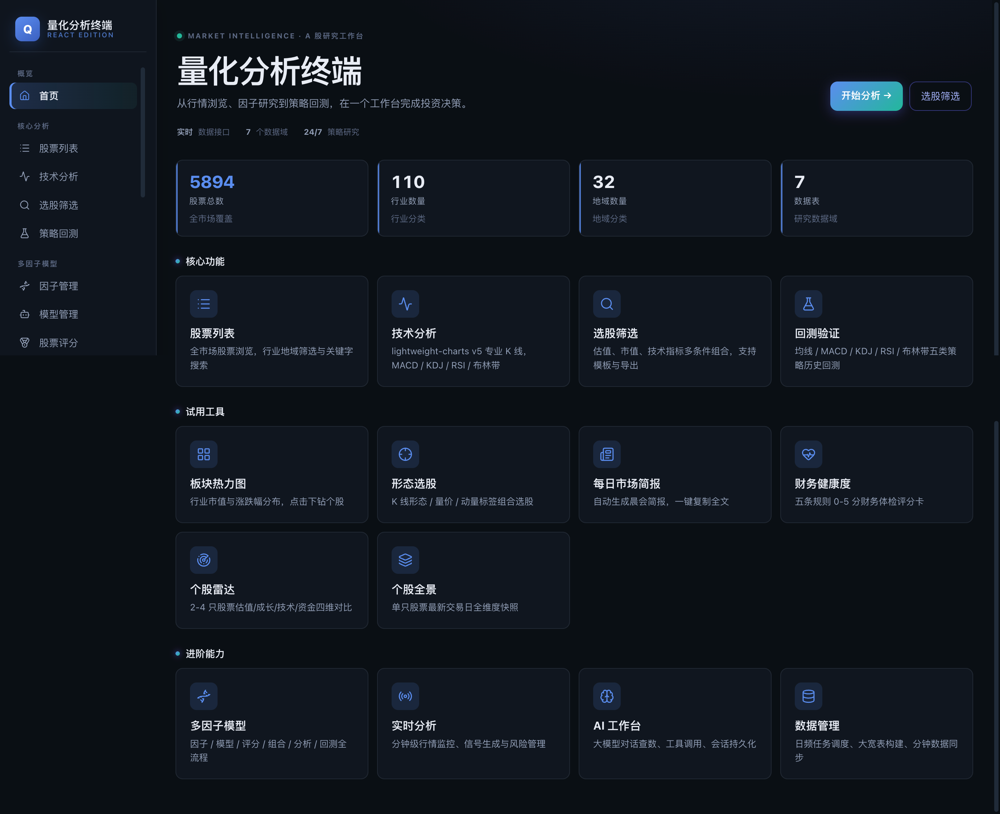

# 多因子选股系统

一个面向 A 股市场的量化分析系统，涵盖实时行情分析、因子计算与研究工具链、机器学习建模、交易信号、组合管理、风险管理、回测验证、盘后自动化预警等完整链路。v4.0 起采用 **React 前端 + Flask API** 架构，数据层延续 Parquet + SQLite，**零外部中间件依赖（无需 MySQL / Redis），克隆即可运行**。

## 项目定位

本项目是**用于学习和二次开发的多因子选股系统原型**，适合继续补齐后再扩展使用。

- 定位：多因子选股系统原型，适合继续补齐后再扩展使用
- 适用场景：量化入门学习、策略研究、二次开发
- 不适用场景：直接用于实盘交易

## 能力现状（已实现 / 部分实现 / 未实现/未开放）

| 模块 | 状态 | 说明 |
| --- | --- | --- |
| 日线/分钟线数据中心 | 已实现 | 任务提交、状态轮询、历史展示（Parquet 存储）；盘后数据链路自动编排与完整性巡检 |
| AI 智能工作台 | 已实现 | 自然语言查数据/更新数据/建宽表/算因子/按区间批量构建因子数据/因子组合回测/训练模型，流式对话，SQL 只读约束；常用查询与看板可收藏复用 |
| 因子计算与表达式 | 已实现 | 内置因子 + Alpha191 因子库（191 个）+ 自定义表达式（白名单校验），point-in-time 公告日打点 |
| 因子研究工具链 | 已实现 | 因子体检与生命周期、IC 衰减、分位组合回测、预测跟踪、组合归因、特征去冗余、训练快照与模型对比、质量监控（因子实验室 / 信号实验室页面） |
| 市场数据资产与信号 | 已实现 | 筹码因子与三类筹码信号、指数 regime、行业轮动评分、财务质量与异动扫描、风格因子 |
| 每日预警与盘后自动化 | 已实现 | 交易日 18:30 调度链（数据链路编排→预警扫描→推送→预测归档→自选提醒），支持企业微信/钉钉/Server酱/Webhook 推送 |
| ML 建模与预测 | 已实现 | XGBoost / LightGBM / RandomForest，防泄漏训练管线 |
| 基础选股评分 | 已实现 | 基础因子评分与 ML 集成评分 |
| 投资组合管理 | 已实现 | 投资组合页面已具备真实创建、详情、持仓增删改、组合删除和优化结果落库能力；支持交易流水记账与日频市值曲线 |
| 回测验证 | 已实现（研究级） | t+1 成交、涨跌停/停牌约束、逐日 mark-to-market 净值已实现；卖出印花税计入成本；注意股票池完整性依赖重新下载含退市股的 stock_basic |
| 报告中心 | 部分实现 | 报告列表与生成功能入口已接通，导出与订阅派发仍在补齐 |
| 实时行情分析 | 部分实现 | React 前端六页已可用（指标/信号/监控/风险/报告/推送）；分钟数据依赖本地同步任务 |
| Text2SQL 查询 | 部分实现 | 只读查询可用（统一只读校验），模板生态待完善 |
| 实盘交易对接 | 未实现/未开放 | 无券商接口，不构成投资建议 |

## 功能概览

### 🤖 AI 智能工作台

通过自然语言对话完成查询分析与系统操作，页面入口：导航栏「AI 工作台」（`/ai-workbench`）。

- **数据查询分析**：大模型生成只读 SQL 查询本地宽表数据（最新交易日快照），自动查看表结构、修正 SQL
- **代办系统功能**：下载/更新数据（需在 .env 配置 TUSHARE_TOKEN）、构建大宽表、计算因子、按日期区间批量构建因子数据（含 Alpha191 全套，后台任务）、基于因子的组合回测与结果查询、创建自定义因子、训练与预测 ML 模型、查询任务进度
- **对话示例**：「构建 alpha191 从 2026 年 1 月至今的数据」「以沪深300为基准，基于 alpha_001 因子回测 2026 年 9 月」——长耗时操作自动转后台任务并返回任务号，追问进度即可
- **安全约束**：SQL 仅允许单条只读 SELECT（复用 text2sql 校验与独立只读查询库）；动作类工具可整体切换为只读模式；大宽表构建保留 18:00 校验
- **沉淀与收藏**：常用查询模板与对话生成的看板可一键收藏，之后一键回填重跑；也可让 AI 调用 save_board / save_query / list_saved 等工具管理
- **配置方式**：在 .env 中设置 `LLM_API_KEY` / `LLM_BASE_URL` / `LLM_MODEL` 即可，兼容 DeepSeek、通义、GLM、Kimi、OpenAI 及本地 Ollama 的 OpenAI 兼容接口；对话为流式输出，工具调用过程全程可见

### 📊 实时行情分析（v4.0 起 React 前端呈现）

- **页面入口**：`/realtime-analysis/*` 六页——技术指标、交易信号、实时监控、风险管理、分析报告、消息推送（SocketIO 实时推送）

- **技术指标**：通达信分钟数据接入，支持 MACD/KDJ/RSI/布林带等指标计算与展示
- **交易信号**：多策略信号生成、信号融合、信号监控、策略回测
- **风险管理**：投资组合持仓管理、实时价格刷新（通达信接口）、风险指标、预警管理、压力测试
- **分析报告**：5 种报告类型（每日总结/组合分析/风险评估/信号分析/市场概览），支持指标卡片、表格、图表可视化
- **实时监控**：板块表现、异动检测、市场情绪指标

### 🧮 因子与选股

- 内置因子计算 + Alpha191 因子库 + 自定义因子表达式（白名单校验）
- **Alpha191 因子库**：国泰君安 191 个短周期选股因子全量内置（189 个可直接计算；alpha_030 需 Fama-French 数据、alpha_143 含递归定义，暂不支持），全市场宽面板向量化计算，其中 4 个（alpha_075/149/181/182）依赖沪深300指数数据
- Alpha191 批量计算脚本：`python scripts/compute_alpha191.py --start 20260101 --end 20260930`（面板一次加载、逐因子落库；也可在 AI 工作台用自然语言触发）
- 基础因子评分与 ML 选股
- 机器学习模型创建、训练（XGBoost / LightGBM / RandomForest）、预测

### 🔬 因子研究工具链

页面入口：「多因子模型」→ 因子实验室（`/ml-factor/factor-lab`，回测/IC/体检/质量四个页签）、信号实验室（`/ml-factor/signal-lab`，预测跟踪/归因/模型对比）。

- **因子体检**：批量评估 IC/收益单调性/换手代理/数据覆盖/共线性，因子生命周期管理（待评估→已评估→采纳/拒绝，采纳白名单可喂 ML 训练）
- **IC 衰减分析**：多前向期 IC、半衰期拟合、滚动 IC 与分年稳定性
- **分位组合回测**：T+1 成交、非重叠持有、换手计费，附成本敏感性网格与分年拆解；无日期请求默认最近两年（防全库扫描）
- **预测跟踪**：逐日预测 IC、top-N 实现收益、horizon 衰减、多模型一致性
- **组合归因**：全市场截面 Fama-MacBeth 因子收益、组合收益归因与当前暴露
- **特征去冗余**：贪心去共线选特征，训练配置开启 `decorrelate_features` 后接入训练链
- **训练快照与模型对比**：训练成功即存快照，支持模型 A/B 对比与特征重要性 Top10
- **因子质量监控**：覆盖/均值/方差时序监控，覆盖骤降/缺席/漂移报警与交易日历分区完整性校验

### 📡 市场数据资产与信号

- **筹码因子与信号**：成本乖离、获利盘水平、集中度 20 日变化等筹码因子；全市场截面扫描挤压蓄势、资金×筹码共振、量价资金背离三类信号（信号实验室「筹码信号」页签）；个股详情含成本分位曲线
- **指数 regime**：动量×均线排列状态标注，组合回测页展示 regime 卡片与四指数净值
- **行业轮动评分**：动量+主力资金+PE 历史分位三维截面 z-score，88 行业评分卡与 top/bottom 净值
- **财务质量与异动**：单票年报杜邦分解趋势与逐期质量分（个股财务页签）；全市场财务异动扫描名单（财务健康页）
- **风格因子**：市值（size_ln_mv）、股息率（dividend_yield）、换手分位（turnover_rank）入因子库

### 📈 组合与回测

- 等权重、均值方差、风险平价、因子中性组合优化
- 投资组合 CRUD：创建、持仓增删改、优化结果落库
- **组合交易流水**：买入/卖出记账（账本为准、加权利成本），删流水自动重放重建持仓，日频市值曲线
- 单策略与多策略回测；长周期回测支持异步模式：提交后立即返回 run_id，轮询进度与结果
- **回测参数寻优**：网格搜索 + walk-forward 滚动样本外验证（IS 选参/OOS 验证/参数稳定性），当前支持均线交叉 / KDJ / RSI
- 组合回测净值附超额净值（策略-基准）曲线；回测页股票选择支持代码/名称模糊检索

### ⏰ 盘后自动化与每日预警

- **调度链**：每个交易日 18:30（`DAILY_ALERT_TIME` 可改，`DAILY_ALERT_ENABLED=0` 关闭）自动执行：盘后数据链路编排 → 每日预警扫描与推送 → 预测跟踪归档 → 自选股价格提醒检查
- **数据链路自动编排**：交易日历→日线→基本指标→资金流→扩展因子→筹码→大宽表→因子计算，串行执行、失败中止、非交易日自动跳过（数据管理页可手动触发）；附数据完整性巡检（各表滞后交易天数）
- **每日预警**：regime 翻转、信号新增、行业轮动榜首变化、数据滞后，落盘 `data/alerts`，市场简报页展示
- **出站推送**：支持企业微信、钉钉、Server酱、自定义 Webhook，市场简报页「推送设置」可配置渠道与推送级别并发送测试
- **自选股**：服务端化管理（分组/备注/价格提醒，页面「市场 → 自选行情」），收盘触发后记录在案并随推送渠道外发；本地 localStorage 自选股首次访问自动迁移

### 💾 数据管理

- **行情数据**：Parquet 格式存储，支持通达信和 Baostock 双数据源
- **应用状态**：SQLite 管理持仓、报告、预警等
- **离线数据包**：提供预下载的历史数据，解压即用
- **数据中心入口**：页面 `/data-management`，支持任务提交、查询、重试、状态过滤、进度轮询、历史展示

## 数据下载
- 视频讲解地址：
  - v2.0版本 https://youtu.be/SpHsZdlyii8  
  - v3.0版本：https://youtu.be/p0iJxGveW60
  - v4.0版本：https://youtu.be/Vn3b8DwRjuY
  - v5.0版本：https://youtu.be/YgSganav4os
  - v6.0版本：https://youtu.be/YPFYBNcmbqU
- 为方便学习使用，数据已改为 Parquet 模式，下载后安装环境即可使用，不需要安装 MySQL
- 数据更新到 2026 年 09 月 22 日，包含历史行情、基本面、技术面、资金流入、筹码分布，每月更新一次

- 百度网盘：https://pan.baidu.com/s/1V7GW68EmA3Ad8lKTLsuG3Q?pwd=bie3
- 如有 Tushare 接口，可通过数据管理页面或AI工作台更新数据

## 工具下载
- anaconda或者python 二选一就行，以免环境冲突，简单一点用python，需要更多功能用anaconda  
- anaconda下载地址： https://mirrors.tuna.tsinghua.edu.cn/anaconda/archive/
- python下载地址，建议用3.12.10
https://www.python.org/downloads/windows/

- 查看SQLite数据库，免费软件可以下载 https://sqlitebrowser.org/dl/ 然后把stock_cursor.sqlite3文件拖入软件中即可使用。



## 🌟 系统特色

### 核心功能
- **📊 因子管理**: 内置因子和受限自定义因子能力
- **🤖 机器学习**: 支持随机森林、XGBoost、LightGBM 等模型定义与训练
- **🎯 基础选股评分**: 支持基础因子评分与 ML 选股链路
- **📈 组合优化**: 当前仅保留已验证的优化方法
- **🔄 回测验证**: 提供基础回测结果和多策略比较能力
- **📋 分析页面**: 仅展示真实返回结果，不再自动填充演示数据


### 技术架构
- **后端**: Python 3.10–3.12 / Flask / SQLAlchemy / SocketIO
- **前端**: React 19 / Vite 7 / TypeScript（SPA；开发态代理 `/api` 与 `/socket.io` 到后端 5000）
- **数据处理**: Pandas / NumPy / Scikit-learn
- **机器学习**: XGBoost / LightGBM / CVXPY
- **任务执行**: 进程内（后台线程 / 本地任务注册表），无需 Redis / Celery
- **市场数据源**: Parquet 文件为主，市场数据统一落在 `data/`
- **ML 因子状态层**: Parquet 文件，状态数据统一落在 `data/ml_factor_state/`
- **应用状态层**: 低并发状态与元数据统一使用 SQLite

## 🚀 快速开始

> 📘 **新手用户**：请从零开始一步步操作的话，推荐阅读详细的 **[从零安装指南（INSTALL.md）](INSTALL.md)**，涵盖环境准备、依赖安装、配置说明、前后端启动、数据下载与常见问题排查。

### 1. 环境要求
- Python 3.10–3.12（最低 3.8+）
- Node.js 22 LTS（仅 React 前端界面需要；只用 API 可跳过）
- 运行系统不需要 MySQL，也不需要 Redis；默认使用 SQLite + Parquet，克隆即可运行

### 2. 安装依赖
```bash
# 克隆项目
git clone <repository-url>
cd quantitative_analysis

# 后端依赖
pip install -r requirements.txt

# 前端依赖（首次需要，Node 22 LTS）
cd frontend && npm install && cd ..

# 环境配置（LLM、Tushare Token 等按需填写）
cp .env.example .env
```

### 2.1 容器化启动
```bash
cp .env.example .env
docker compose up --build
```

默认只启动 Web 单容器（SQLite 与 parquet 状态均为本地文件）；市场数据和 ml-factor 状态以本地 parquet 文件为准。

### 3. 启动系统

运行当前已接通功能入口：

```bash
# 终端 1：后端 API + SocketIO（端口 5000）
python run.py

# 终端 2：React 前端开发服务器（端口 5173）
cd frontend && npm run dev
```

也可以用一键启停脚本（前后端一起管理，支持 start / stop / restart / status；前端默认端口 5180）：

```bash
# macOS / Linux
scripts/dev_server.sh start

# Windows
scripts/dev_server.ps1 start   # 或 scripts/dev_server.bat start
```

常规 Web 启动统一使用 `python run.py`。run_system.py 用于初始化与诊断（检查依赖、校验数据库和补建基础表），不作为日常启动入口。

> 模型删除前后端入口已打通：模型管理页面的删除按钮与 `/api/ml-factor/models/<id>` DELETE 接口均已接通。

# 遇到以下问题
```
Traceback (most recent call last):
  File "/root/stock/run.py", line 9, in <module>
    app = create_app(os.getenv('FLASK_ENV', 'default'))

执行：pip install eventlet
```


### 4. 访问系统
- React 界面（推荐入口）: http://localhost:5173
- Flask 页面: http://localhost:5000
- API入口: http://localhost:5000/api

## 📖 使用指南

### 启动方式

#### 1. 常规启动
运行 `python run.py` 后，系统会输出启动检查摘要，并默认在开发环境下启动 Web 服务。

#### 2. 初始化与诊断
运行 `python run_system.py` 后，可执行以下操作：

1. **检查系统依赖** - 验证Python版本和必需包
2. **初始化数据库** - 创建数据表和内置因子
3. **启动Web服务器** - 启动开发模式服务器（调试用途）
4. **启动Web服务器(生产模式)** - 启动生产模式服务器
5. **运行系统演示** - 运行当前已接通功能入口
6. **显示系统信息** - 查看系统功能概览


### Web界面操作

#### 1. 仪表盘
- 查看系统状态和统计信息
- 快速访问主要功能


#### 2. 因子管理
- 查看内置因子列表
- 创建自定义因子
- 计算因子值


#### 3. 模型管理
- 创建机器学习模型
- 训练模型
- 模型预测


#### 4. 股票选择
- 基于因子的选股
- 基于ML模型的选股
- 配置选股参数


#### 5. 组合优化
- 多种优化方法
- 约束条件设置
- 权重分配结果


#### 6. 分析报告
- 行业分析
- 因子贡献度分析


#### 7. 回测验证
- 单策略回测
- 多策略比较
- 失败时不再自动展示模拟结果


### API接口使用


## 🏗️ 系统架构


### 目录结构
```
quantitative_analysis/
├── app/                          # 应用主目录
│   ├── api/                     # API 蓝图（ml_factor、realtime_*等）
│   ├── models/                  # 数据模型（SQLAlchemy + Parquet事件）
│   ├── services/                # 业务服务（因子引擎、信号引擎、风控等）
│   ├── routes/                  # 页面路由
│   ├── templates/               # Jinja2 HTML 模板
│   ├── static/                  # CSS/JS/图片静态资源
│   ├── utils/                   # 数据下载脚本（通达信/Baostock/Tushare）
│   ├── websocket/               # WebSocket 推送服务
│   └── services/tongdaxin/      # 通达信行情客户端
├── frontend/                     # React 前端（React 19 + Vite 7 + TypeScript）
│   └── src/
│       ├── pages/               # 功能页面（实时分析、多因子模型、AI 工作台等）
│       ├── api/                 # 统一 API 客户端与类型定义
│       └── components/          # 共享组件
├── data/                         # 数据目录（Parquet 行情 + SQLite 状态）
│   ├── stock_minute/            # 分钟级行情 Parquet
│   ├── ml_factor_state/         # ML因子状态 Parquet
│   └── realtime_events/        # 实时事件 Parquet
├── tests/                        # 测试用例
├── scripts/                      # 批量计算/回填/启停脚本（compute_alpha191、backfill_factor_stats、dev_server 等）
├── config.py                     # 配置文件
├── requirements.txt              # 依赖包
├── requirements-dev.txt          # 开发/测试依赖（CI 使用）
├── run.py                        # Web 启动入口
├── run_system.py                 # 初始化与诊断工具
└── README.md                     # 说明文档
```

### 核心模块

#### 1. 因子引擎 (FactorEngine)
- 因子定义管理
- 因子值计算
- 支持自定义公式

#### 2. 机器学习管理器 (MLModelManager)
- 模型创建和训练
- 预测和评估
- 支持多种算法

#### 3. 股票打分引擎 (StockScoringEngine)
- 因子打分
- ML模型打分
- 综合评分

#### 4. 组合优化器 (PortfolioOptimizer)
- 多种优化算法
- 约束条件支持
- 风险模型估计

#### 5. 回测引擎 (BacktestEngine)
- 策略回测
- 性能指标计算
- 多策略比较

## 📊 内置因子

### 动量因子
- `momentum_1d`: 1日动量
- `momentum_5d`: 5日动量
- `momentum_20d`: 20日动量

### 波动率因子
- `volatility_20d`: 20日波动率

### 技术指标
- `rsi_14`: RSI相对强弱指标

### 成交量因子
- `turnover_rate`: 换手率

### 基本面因子
- `pe_ratio`: 市盈率
- `pb_ratio`: 市净率
- `roe`: 净资产收益率
- `debt_ratio`: 资产负债率
- `current_ratio`: 流动比率
- `gross_margin`: 毛利率

## 🔧 配置说明

### 数据库配置
已经改成parquet模式，不需要数据库

### 关键环境变量（.env，详见 `.env.example` 注释）
- `TUSHARE_TOKEN`：数据更新（数据管理页 / AI 工作台）
- `LLM_API_KEY` / `LLM_BASE_URL` / `LLM_MODEL`：AI 工作台大模型（OpenAI 兼容接口）
- `API_AUTH_TOKEN`：设置后所有 `/api/*` 请求须携带 Token（`X-API-Token` 头或 Bearer）；生产环境强制要求 ≥16 位随机串，本机单人使用可留空
- `DAILY_ALERT_ENABLED` / `DAILY_ALERT_TIME`：盘后自动化调度开关与时间（默认开、18:30）
- `FUYAO_API_KEY` / `TICKFLOW_API_KEY`：可选第三方行情数据源（与 Tushare 相互独立）

### 日志配置
```python
LOG_LEVEL = 'INFO'
LOG_FILE = 'logs/app.log'
```

## 📈 性能指标

系统支持的回测指标：
- 总收益率
- 年化收益率
- 年化波动率
- 夏普比率
- 最大回撤
- 胜率
- 卡尔玛比率

## 🛠️ 开发指南

### 添加自定义因子
1. 在因子管理界面创建因子定义
2. 编写因子计算公式
3. 测试因子计算结果

### 扩展机器学习模型
1. 在 `MLModelManager` 中添加新算法
2. 实现训练和预测方法
3. 更新API接口

### 添加优化算法
1. 在 `PortfolioOptimizer` 中实现新方法
2. 添加约束条件支持
3. 测试优化结果

## 🐛 故障排除

### ⚠️ 依赖包兼容性问题

如果遇到 `empyrical` 或 `TA-Lib` 安装失败，请优先安装标准依赖；若本地环境仍有兼容性问题，再退回最小依赖安装：

```bash
# 使用最小化依赖
pip install -r requirements_minimal.txt
```

### 常见问题

1. **依赖包安装失败**
   ```bash
   # 方案1：安装标准依赖
   pip install -r requirements.txt
   
   # 方案2：使用国内镜像安装最小依赖
   pip install -r requirements_minimal.txt -i https://pypi.tuna.tsinghua.edu.cn/simple/
   ```

2. **Python版本兼容性**
   - 推荐使用 Python 3.10–3.12
   - 个别包兼容问题时可退回 `requirements_minimal.txt`

3. **前端打开但接口报错 / 无数据**
   - 确认后端已启动（`python run.py`，端口 5000）
   - 开发模式下前端 5173 通过代理访问 `/api` 与 `/socket.io`，无需额外跨域配置
   - 页面无数据多为行情数据未同步，先在数据管理页面下载对应数据

4. **因子计算失败**
   - 检查数据是否存在
   - 验证因子公式语法
   - 查看日志错误信息

5. **模型训练失败**
   - 确保有足够的训练数据
   - 检查因子数据完整性
   - 调整模型参数

## 📝 更新日志

### v6.1.0 (2026-10-08)

**因子研究闭环 + 市场数据资产 + 盘后自动化**：

- 因子研究链八件套：因子体检与生命周期管理（采纳白名单喂 ML）、IC 衰减分析、预测跟踪、组合归因（Fama-MacBeth）、特征去冗余接入训练链、训练快照与模型 A/B 对比、因子质量监控；前端新增因子实验室（回测/IC/体检/质量）与信号实验室（预测跟踪/归因/模型对比）页面
- Alpha191 截面标准化（percentile_rank / z_score）回填 + 分位组合回测：T+1 成交、非重叠持有、换手计费、成本敏感性网格与分年拆解
- 市场数据资产：筹码因子（成本乖离/获利盘/集中度）与三类筹码信号、指数 regime 状态、行业轮动评分（88 行业）、财务质量（杜邦分解）与全市场财务异动扫描、风格因子（市值/股息率/换手分位）
- 信号有效性回测闭环：筹码信号历史回测（T+1 开—开、H 日不重叠调仓复利）、信号阈值抽取共享配置（回测页可做阈值实验）
- 盘后自动化：交易日 18:30 调度链（数据链路自动编排→数据完整性巡检→每日预警→出站推送→预测跟踪归档→自选价格提醒）；预警支持企业微信/钉钉/Server酱/自定义 Webhook
- 平台闭环：回测参数寻优（网格搜索 + walk-forward 滚动样本外）、组合交易流水与市值曲线、自选股服务端化（分组/备注/价格提醒）、AI 工作台查询/看板收藏沉淀
- 复权数据源切换：stk_factor → 独立 adj_factor 表；因子区间回填提速（按覆盖跳过 + 跨因子缓冲批量落盘）
- 安全与正确性整改：可选 `API_AUTH_TOKEN` 门禁保护全部 `/api/*`（生产强制 Token）、Text2SQL 按查询日期范围加载、数据任务提交白名单、启动改用僵尸任务回收；新增 requirements-dev.txt
- 开发体验：`scripts/dev_server.sh`（Windows 为 ps1/bat）一键启停前后端；IC/分层/相关性分析无日期请求默认最近两年（防全库扫描）

### v6.0.0 (2026-10-02)

**Alpha191 因子库 + AI 工作台因子/回测自然语言链路**：

- Alpha191 因子库：国泰君安 191 个短周期选股因子全量内置（189 个可直接计算），全市场宽面板向量化计算，因子管理页与打分/回测链路可直接消费；批量计算脚本 `scripts/compute_alpha191.py`
- AI 工作台新增三个工具：`calculate_factors_range`（按日期区间批量构建因子数据，alpha191 走面板批量、后台任务）、`run_backtest`（因子选股组合回测，异步返回 run_id）、`get_backtest_status`（查询进度与收益/回撤/夏普/alpha 等核心指标）——「构建 alpha191 从 2026 年 1 月至今的数据」「以沪深300为基准基于 alpha_001 回测 2026 年」这类需求可自然语言完成
- 因子计算数据作业（factor_compute）支持 alpha191 区间批量路由；AI 工作台支持通过因子 ID 列表 + 时间窗提交批量计算
- 修复：历史回测 run 的脏 summary 字段（标量）导致孤儿回测清理崩溃

### v5.0.0 (2026-09-25)

- 基金数据全链路：接入fuyao（同花顺）/api/fund/* 14 个端点，新增「基金列表」页与「基金中心」详情页，AI 工作台新增 query_fund 工具
- 个股分区：行情数据按股票构建，查询/下载/AI 全链路接入
- 研报中心：东财五类研报检索 + 正文下载解析
- 数据源整合：fuyao 数据源独立于 tushare，接入同花顺特色数据（历史热股/排名走势/个股异动原因等）
- React 前端焕新：新设计体系 + 多个新页面（市场看板/自选/龙虎榜/数据源中心/连板天梯/概念行业分析等）

### v4.0.0 (2026-09-03)

**前端重构 + 去 Redis 化**：React 19 + Vite 7 + TypeScript 全新前端（29 个页面），移除 Redis / Celery 外部依赖，单容器即可部署。

- React 前端：实时分析六页（指标/信号/监控/风险/报告/推送）、多因子模型六页（因子/训练/评分/组合优化/分析图表/异步回测）、AI 工作台（SSE 流式对话）、数据管理、Text2SQL；统一 API 客户端与错误处理
- 去 Redis 化：缓存改为进程内 TTL 缓存，任务改为进程内执行（`DATA_JOB_EXECUTION_MODE` 保留为兼容项，任意值均为本地执行）；docker-compose 精简为 web 单服务；依赖移除 celery / redis
- 异步回测：提交后立即返回 run_id，前端轮询进度与结果
- 质量体系：测试套件入库（195 个文件 / 552 项），`acceptance/<module>.md` 结构性合约注册表 + pytest module marker；经三轮独立评审关闭全部发现
- 文档：新增从零安装指南 INSTALL.md；master 分支自本版本起包含完整前端

### v3.0.0 (2026-08)

试用功能 + AI 智能工作台：

- 试用数据面板：市场简报、财务健康度、资金流统计、个股雷达/全景、板块热力图（`/trial/*`）
- AI 智能工作台：大模型对话驱动的数据查询与系统操作，流式输出、只读 SQL 约束
- 量化正确性修复（明细见下方 2026-08-24 小节）
- Docker 部署支持

### 量化正确性修复 (2026-08-24，随 v3.0.0 发布)

**数据底座**
- 股票基础资料同时下载 L/D/P 全部上市状态并携带 delist_date，消除幸存者偏差；因子计算按历史时点过滤股票池（退市股、未上市股不参与）
- 动量/波动率等收益率类因子与 ML 标签改用后复权价（`get_return_prices`），除权除息缺口不再被当成真实涨跌
- 交易日历下载范围扩展至 2005 年起，财务公告日可对齐到准确的历史交易日

**因子引擎**
- ROE/ROA/营收增长/利润增长改为按公告日逐季度生成 point-in-time 快照（此前每股仅落库最新一期，历史日期取不到基本面因子）

**组合优化与回测**
- 协方差矩阵按调仓日截断估计，消灭用"今天"的数据回测历史的前视偏差
- 净值曲线改为逐日 mark-to-market：最大回撤/波动率/夏普不再被调仓频率采样系统性失真
- 截面 z-score 映射为年化预期收益后再喂给均值方差优化（量纲匹配，避免角点解）
- 卖出印花税（0.05%）计入交易成本；夏普分子改算术平均超额收益；信息比率分母改真跟踪误差；年化统一 252 交易日口径
- 单股回测补齐涨跌停/停牌约束与印花税

**ML 链路**
- 训练/测试时间切分加入 purge/embargo，交叉验证只在训练段进行
- 训练窗口落库；预测拒绝训练区间内的 in-sample 请求；预测兜底日期格式统一 YYYY-MM-DD
- 自定义因子表达式禁负 shift/pct_change/diff 与全序列 rank（防未来函数），rolling 窗口设上限

> 注意：升级后需重新下载 `stock_basic` 与 `stock_trade_calendar`，并用新逻辑重算受影响的因子（momentum_*/volatility_*/price_to_ma20 及四个基本面因子）。

### v2.0.0-parquet (2026-06-06)

**架构升级**：从 MySQL 迁移到 Parquet + SQLite，零外部数据库依赖，克隆即可运行。

- 实时行情分析模块：技术指标、交易信号（生成/融合/监控/回测）、风险管理（持仓/预警/压力测试）、分析报告（5种类型，可视化渲染）、实时监控（板块/异动/情绪）
- 通达信实时行情接入，支持批量获取报价和自动刷新持仓价格
- 日频数据中心：页面内直接触发数据下载脚本，支持任务管理和进度轮询
- 数据存储全面迁移到 Parquet（行情/指标/信号/状态），SQLite 仅保留应用元数据
- 投资组合管理完整闭环：创建、持仓增删改、实时价格刷新、优化落库
- 报告可视化：指标卡片、HTML 表格、ECharts 图表、预警卡片等类型化渲染
- 离线数据包：提供预下载的 A 股历史数据，解压即用

### v1.0.0 (2025-06-01)
- 多因子选股系统初始版本
- 因子管理和计算、机器学习模型集成
- 组合优化、回测验证引擎
- Web 界面和 API 接口

## 📄 许可证

本项目采用 MIT 许可证。

## 🤝 贡献

欢迎提交Issue和Pull Request来改进这个项目。

## 📞 联系方式

如有问题或建议，请通过以下方式联系：
- 提交Issue

---

**多因子选股系统原型** - 适合继续补齐后再扩展使用。 
